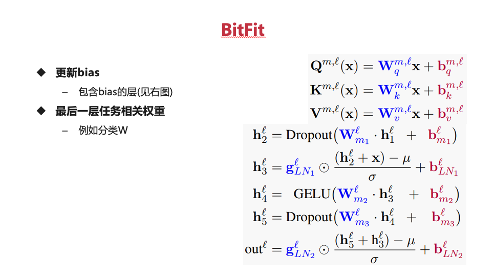
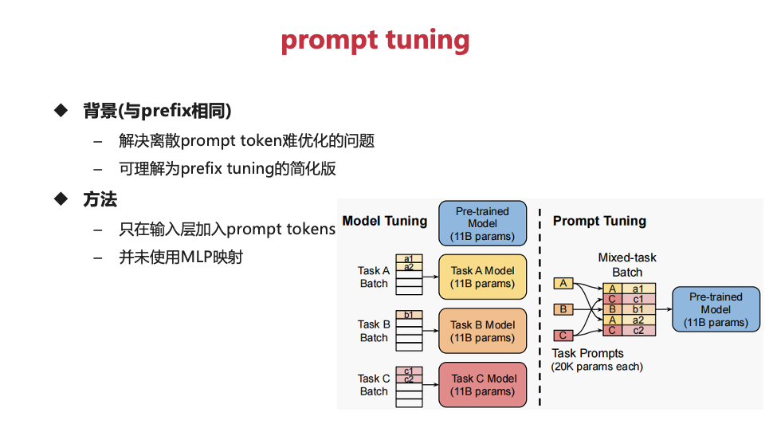
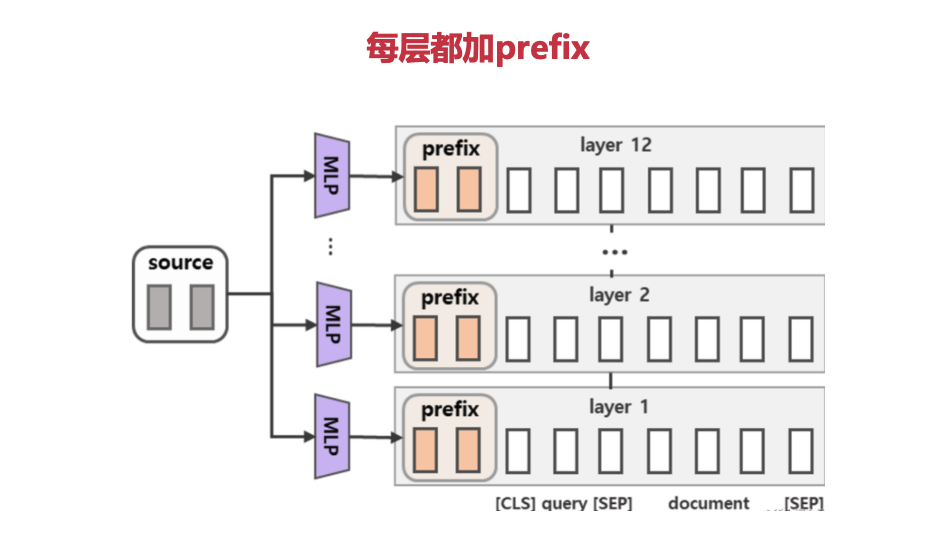

# play-with-instruct-model

从0到1实现一个简单的instruct-gpt(使用facebook/opt-125m)，从训练到模型的构建，主要分成三个步骤：

### 1. 人工标注：SFT (supervised fine-tune)
- **相关文件**：`train_sft.py`
- **功能描述**：
  - 使用 `instruction -> response` 数据集进行监督微调。对于从未经过对齐的GPT-3来说，这一步比较重要，但对于ChatGPT则不必要。
  - 如果这一步的数据集足够大，甚至可以忽略后续的RLHF（人类反馈强化学习）步骤。

### 2. 人类反馈
- **相关文件**：`train_rm.py`
- **功能描述**：
  - 基于GPT-3的SFT模型对同一 `instruction` 给出的多个 `response` 进行排序。
  - 利用基于排序的pair-wise loss（成对损失）来训练 `response` 评分模型RM（Reward Model）。

### 3. 强化学习PPO
- **相关文件**：`train_rlhf.py` .
- **功能描述**：
  - GPT-3的SFT模型使用RM评分模型作为奖励（reward）；当然也可以用人的评分做微调。
  - 使用PPO（Proximal Policy Optimization）算法进行fine-tune（微调）。
  - 主要分成3个loss = actor_loss + LLM_loss + value_loss(crtic_loss)

仓库的目录结构如下：
- `train_rm.py` 和 `train_sft.py` 是主要的训练脚本。
- `trainer` 文件夹包含训练器相关的代码，如 `base.py`、`rm.py`、`sft.py`。
- `model` 文件夹包含模型相关的代码，包括基础模型和一些自定义损失函数等。
- `pic` 文件夹存放图片，如 `1.png` 用于说明整体流程。
- `ds` 文件夹存放数据集，如 `alpaca-en.json`、`rm.jsonl` 等。
- `dataset` 文件夹包含数据集处理相关的代码，如 `prompt_dataset.py`、`rm_dataset.py`、`sft_dataset.py` 等。
- `utils.py` 包含一些工具函数。

### PEFT
#Prompt_tuning
- PEFT（Parameter-Efficient Fine-Tuning）是一种在深度学习模型微调过程中减少需要更新参数数量的技术集合，从而使得调整大型预训练模型更加高效和经济。通过PEFT方法，我们能够显著降低对计算资源的需求，并且避免了传统全参数微调中可能出现的问题，比如灾难性遗忘——即模型在学习新任务时可能会忘记之前学过的知识。
#### BitFit

- 

####  prompt_tuning

-  最简单的微调方式使用的是提示词进行训练，额外虚拟的token塞到模型的embedding层。
-  使用自己的实验prompt-tuning trainable params: 7,680 || all params: 125,246,976 || trainable%: 0.0061
####  p-tuning

- 使用了LSTM+MLP的方式对提升词进行训练，塞到的模型模型的embedding层中

#### prefix-tuning

- 每一层都需要对于q,k,v的结果进行修改
- 使用自己的实验trainable params: 184,320 || all params: 125,423,616 || trainable%: 0.1470

#### lora

- 使用自己的实验trainable params: trainable params: 147,456 || all params: 125,386,752 || trainable%: 0.1176

### 一个简单的peft的例子
