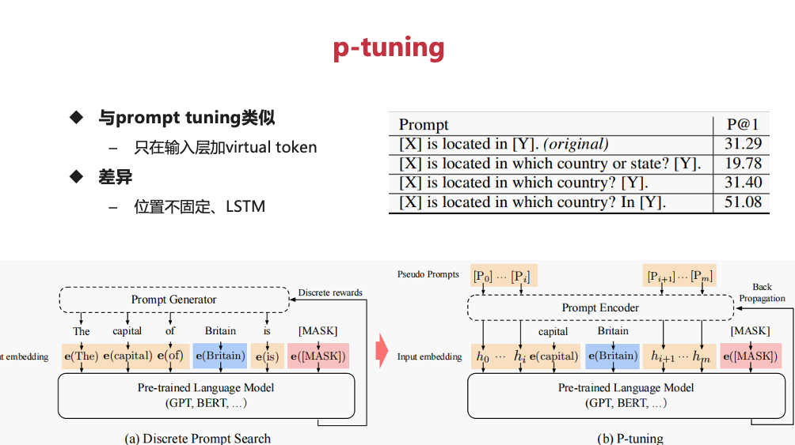
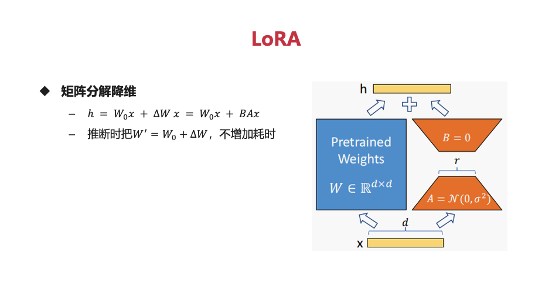

# play-with-instruct-model

本仓库旨在从0到1实现一个简单的instruct-gpt，使用 `facebook/opt-125m` 模型，涵盖从训练到模型构建的全过程。主要步骤分为三个部分，整体流程如下图所示：

## 主要步骤

### 1. 人工标注：SFT (supervised fine-tune)
- **相关文件**：`train_sft.py`
- **功能描述**：
  - 利用 `instruction -> response` 数据集进行监督微调。对于从未经过对齐的GPT-3模型而言，这一步至关重要，因为它有助于引导模型生成符合预期的响应。然而，对于像ChatGPT这样已经经过精心预训练和对齐的模型，这一步可能并非必需。
  - 如果这一步所使用的数据集规模足够大，甚至可以考虑忽略后续的RLHF（人类反馈强化学习）步骤，因为大规模的监督微调可能已经能够使模型达到较好的性能。

### 2. 人类反馈
- **相关文件**：`train_rm.py`
- **功能描述**：
  - 基于GPT-3的SFT模型，对同一 `instruction` 给出的多个 `response` 进行排序。通过这种方式，可以获得不同 `response` 之间的相对优劣信息。
  - 利用基于排序的pair-wise loss（成对损失）来训练 `response` 评分模型RM（Reward Model）。该模型能够学习到 `response` 的质量评分，为后续的强化学习提供奖励信号。

### 3. 强化学习PPO
- **相关文件**：`train_rlhf.py`
- **功能描述**：
  - GPT-3的SFT模型使用RM评分模型作为奖励（reward），当然也可以采用人工评分进行微调。RM评分模型能够提供关于 `response` 质量的量化反馈，帮助模型学习生成更高质量的响应。
  - 使用PPO（Proximal Policy Optimization）算法进行fine-tune（微调）。PPO是一种常用的强化学习算法，能够在保证模型稳定性的同时，有效地优化模型的策略。
  - 主要的损失函数由三部分组成：`loss = actor_loss + LLM_loss + value_loss(critic_loss)`。其中，`actor_loss` 用于优化模型的策略网络，`LLM_loss` 考虑了语言模型本身的损失，`value_loss` 则用于优化价值网络，以更好地估计状态价值。

## 仓库目录结构

- **训练脚本**：`train_rm.py` 和 `train_sft.py` 是主要的训练脚本，负责驱动模型的训练过程。
- **训练器相关代码**：`trainer` 文件夹包含训练器相关的代码，如 `base.py`、`rm.py`、`sft.py`。这些代码实现了训练过程中的各种功能，如数据加载、模型更新等。
- **模型相关代码**：`model` 文件夹包含模型相关的代码，包括基础模型和一些自定义损失函数等。这些代码定义了模型的架构和训练过程中使用的损失函数。
- **图片资源**：`pic` 文件夹存放图片，如 `1.png` 用于说明整体流程，方便用户直观地理解项目的架构和工作原理。
- **数据集**：`ds` 文件夹存放数据集，如 `alpaca-en.json`、`rm.jsonl` 等。这些数据集用于模型的训练和评估。
- **数据集处理代码**：`dataset` 文件夹包含数据集处理相关的代码，如 `prompt_dataset.py`、`rm_dataset.py`、`sft_dataset.py` 等。这些代码负责将原始数据转换为模型可以处理的格式。
- **工具函数**：`utils.py` 包含一些工具函数，这些函数可以在项目的不同部分被复用，提高代码的可维护性和可扩展性。

## PEFT（Parameter-Efficient Fine-Tuning）

PEFT是一种在深度学习模型微调过程中减少需要更新参数数量的技术集合。通过采用PEFT方法，我们能够显著降低对计算资源的需求，同时避免传统全参数微调中可能出现的问题，如灾难性遗忘（即模型在学习新任务时可能会忘记之前学过的知识）。以下是几种常见的PEFT技术：

### BitFit

### Prompt Tuning

- **原理**：最简单的微调方式是使用提示词进行训练，将额外虚拟的token嵌入到模型的embedding层中。
- **实验结果**：使用自己的实验数据，Prompt Tuning的可训练参数为7,680，总参数为125,246,976，可训练参数占比为0.0061。

### P-Tuning

- **原理**：使用LSTM + MLP的方式对提升词进行训练，并将其嵌入到模型的embedding层中。

### Prefix Tuning

- **原理**：每一层都需要对q（查询向量）、k（键向量）、v（值向量）的结果进行修改。
- **实验结果**：使用自己的实验数据，Prefix Tuning的可训练参数为184,320，总参数为125,423,616，可训练参数占比为0.1470。

### LoRA

- **实验结果**：使用自己的实验数据，LoRA的可训练参数为147,456，总参数为125,386,752，可训练参数占比为0.1176。

## 简单的PEFT例子

使用一个简单的例子通过LoRA方式进行微调，从而让大模型可以记住我们的问题。具体实现见 [ChatGLM2_AdaLoRA.ipynb](https://github.com/HuichuanLI/play-with-instruct-model/blob/main/ChatGLM2_AdaLoRA.ipynb)。
