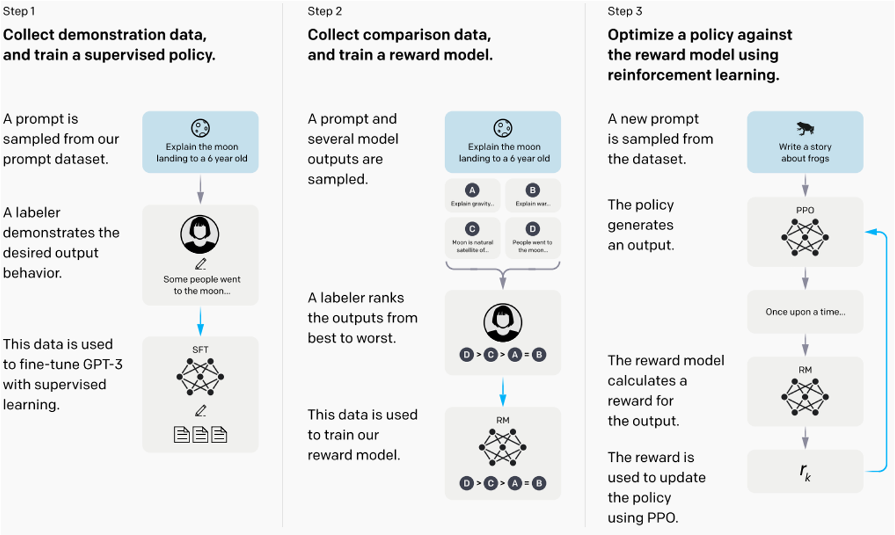

# play-with-instruct-model

从0到1实现一个简单的instruct-gpt(使用facebook/opt-125m)，从训练到模型的构建，主要分成三个步骤：

### 1. 人工标注：SFT (supervised fine-tune)
- **相关文件**：`train_sft.py`
- **功能描述**：
  - 使用 `instruction -> response` 数据集进行监督微调。对于从未经过对齐的GPT-3来说，这一步比较重要，但对于ChatGPT则不必要。
  - 如果这一步的数据集足够大，甚至可以忽略后续的RLHF（人类反馈强化学习）步骤。

### 2. 人类反馈
- **相关文件**：`train_rm.py`
- **功能描述**：
  - 基于GPT-3的SFT模型对同一 `instruction` 给出的多个 `response` 进行排序。
  - 利用基于排序的pair-wise loss（成对损失）来训练 `response` 评分模型RM（Reward Model）。

### 3. 强化学习PPO
- **相关文件**：`tran_rlhf.py`（推测可能是 `train_rlhf.py` .
- **功能描述**：
  - GPT-3的SFT模型使用RM评分模型作为奖励（reward）。
  - 使用PPO（Proximal Policy Optimization）算法进行fine-tune（微调）。

仓库的目录结构如下：
- `train_rm.py` 和 `train_sft.py` 是主要的训练脚本。
- `trainer` 文件夹包含训练器相关的代码，如 `base.py`、`rm.py`、`sft.py`。
- `model` 文件夹包含模型相关的代码，包括基础模型和一些自定义损失函数等。
- `pic` 文件夹存放图片，如 `1.png` 用于说明整体流程。
- `ds` 文件夹存放数据集，如 `alpaca-en.json`、`rm.jsonl` 等。
- `dataset` 文件夹包含数据集处理相关的代码，如 `prompt_dataset.py`、`rm_dataset.py`、`sft_dataset.py` 等。
- `utils.py` 包含一些工具函数。

